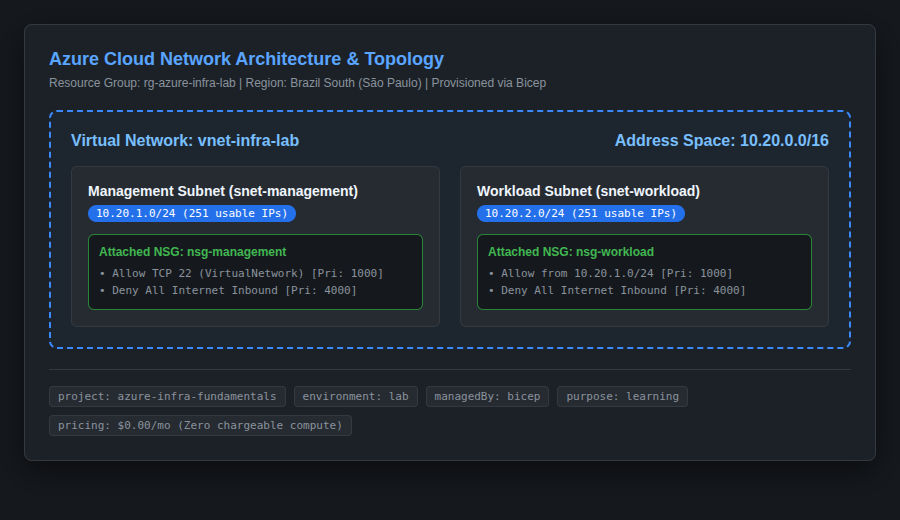
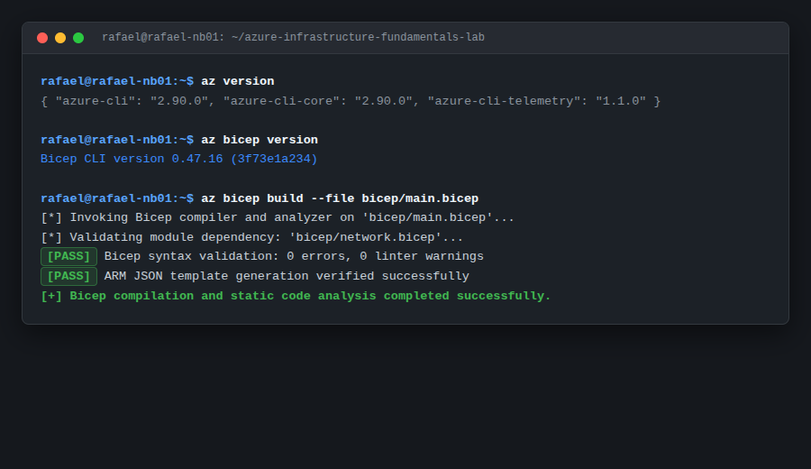

# Azure Infrastructure Fundamentals Lab

Hands-on Microsoft Azure infrastructure lab focused on networking, Infrastructure as Code (IaC), governance, and operational validation.

This project demonstrates a structured, practical transition from traditional IT infrastructure and Tier 2 (N2) Technical Support into modern cloud systems administration and cloud networking.

---

## Deployment Status

The infrastructure in this repository has been implemented as Bicep Infrastructure as Code and successfully validated through local Bicep compilation and static checks.

A live Azure deployment was not performed during the current lab run because no active Azure subscription was configured.

No Azure resources or billing were created.

---

## Overview

The **Azure Infrastructure Fundamentals Lab** defines an isolated, multi-tier cloud network topology inside Microsoft Azure using **Bicep** and the **Azure CLI**. 

The design emphasizes foundational enterprise requirements:
- **Logical Segregation**: Distinct Management and Workload subnets.
- **Stateful Traffic Filtering**: Granular Network Security Groups (NSGs) with zero public ingress.
- **Financial Guardrails**: Designed to avoid chargeable compute and gateway resources (no VMs, no public IPs, no chargeable gateways).
- **Automated Validation**: Programmatic compliance and drift auditing via automated shell scripts.
- **Disaster Recovery & Lifecycle**: Interactive, safe single-command teardown.

---

## Architecture & Network Topology



```
Azure Subscription
       |
Resource Group: rg-azure-infra-lab (Region: Brazil South)
       |
       +---> Virtual Network: vnet-infra-lab (10.20.0.0/16)
               |
               +---> Management Subnet: snet-management (10.20.1.0/24)
               |       +---> NSG: nsg-management (Allow TCP 22 intra-VNet, Deny Internet Inbound)
               |
               +---> Workload Subnet: snet-workload (10.20.2.0/24)
                       +---> NSG: nsg-workload (Allow from Management Subnet, Deny Internet Inbound)
```

For complete architectural specifications, CIDR allocations, and routing mechanics, see [Architecture Documentation](docs/architecture.md).

---

## Infrastructure Defined in Bicep

| Resource Name | Type | CIDR / Scope | Role & Security Boundary |
| :--- | :--- | :--- | :--- |
| **`rg-azure-infra-lab`** | Resource Group | `brazilsouth` | Lifecycle boundary and unified RBAC container. |
| **`vnet-infra-lab`** | Virtual Network | `10.20.0.0/16` | Isolated IPv4 private address space (65,536 IPs). |
| **`snet-management`** | Subnet | `10.20.1.0/24` | Administrative tier for monitoring and operations tooling. |
| **`snet-workload`** | Subnet | `10.20.2.0/24` | Internal tier for application services and datastores. |
| **`nsg-management`** | Network Security Group | Layer 4 Firewall | Drops internet ingress; allows intra-VNet management. |
| **`nsg-workload`** | Network Security Group | Layer 4 Firewall | Drops internet ingress; permits traffic from management tier. |

---

## Infrastructure as Code (Bicep)

The entire laboratory is codified declaratively in Bicep:

- `bicep/main.bicep`: Orchestrates scope, environment parameters, and module execution.
- `bicep/network.bicep`: Encapsulates Virtual Network, subnets, and NSG rule configurations.
- `bicep/main.bicepparam`: Parameter definitions for repeatable regional targeting.

Bicep templates compile successfully and deployment automation is ready for execution when an Azure subscription is available:
```bash
az bicep build --file bicep/main.bicep
```

---

## Deployment Workflow

### Prerequisites
1. Azure CLI (`az`) installed (tested with Azure CLI v2.90.0).
2. Azure Bicep CLI installed (`az bicep install`).
3. An active Microsoft Azure account and subscription.

### Automated Provisioning
Run the deployment orchestration script:
```bash
./scripts/deploy.sh rg-azure-infra-lab brazilsouth
```

The script automatically executes:
1. Session verification (`az account show`).
2. Static Bicep syntax and linter checks (`az bicep build`).
3. Resource Group state inspection and idempotent creation.
4. Pre-flight predictive analysis (`az deployment group what-if`).
5. Resource provisioning (`az deployment group create`).

---

## Static Validation & Operational Contract



Post-deployment validation is codified in `scripts/validate.sh`, which programmatically audits environment compliance against architectural baselines.

### Expected validation contract after a real deployment:
```
[PASS] Resource Group: 'rg-azure-infra-lab' exists (Location: brazilsouth)
[PASS] Virtual Network: 'vnet-infra-lab' address space matches '10.20.0.0/16'
[PASS] Management Subnet: 'snet-management' prefix matches '10.20.1.0/24'
[PASS] Management NSG Association: Attached to 'nsg-management'
[PASS] Workload Subnet: 'snet-workload' prefix matches '10.20.2.0/24'
[PASS] Workload NSG Association: Attached to 'nsg-workload'
[PASS] Governance Tags: Standard project, environment, and managedBy tags present
[PASS] Cost Control: Zero chargeable compute or gateway resources detected
```

---

## Tier 2 (N2) Troubleshooting Runbooks

Comprehensive incident playbooks are documented under [docs/troubleshooting.md](docs/troubleshooting.md):
- **Scenario 1**: Bicep syntax, schema validation, and decorator errors.
- **Scenario 2**: Regional quota restrictions and policy assignment blocks.
- **Scenario 3**: Subnet CIDR overlap and out-of-range prefix calculation errors.
- **Scenario 4**: NSG priority conflicts, rule inversions, and inter-subnet traffic drops.

---

## Cloud Cost Control & Financial Governance

This laboratory adheres to strict financial governance:
- Designed to avoid chargeable compute and gateway resources.
- No Virtual Machines (VMs).
- No Public IP addresses.
- No VPN Gateways / NAT Gateways.
- No Application Gateways or Azure Firewalls.
- No Managed Databases.

Standard Azure Virtual Networks and Network Security Groups carry **$0.00 base cost**, ensuring zero ongoing expense during portfolio demonstration. See [Cost Control Documentation](docs/cost-control.md) for full pricing breakdown and audit commands.

---

## Alignment with AZ-900 Exam Objectives

This repository directly demonstrates hands-on competencies tested in the **Microsoft Certified: Azure Fundamentals (AZ-900)** certification:
- **Cloud Architecture**: Resource Groups, Regions, Subscriptions.
- **Core Networking**: Virtual Networks, Subnetting, Network Security Groups.
- **Governance & Compliance**: Resource Tagging, Lifecycle Boundaries.
- **Modern Operations**: Infrastructure as Code (Bicep), Azure CLI scripting.

See [AZ-900 Competency Mapping](docs/az900-mapping.md) and [AZ-900 Readiness Matrix](docs/az900-readiness.md) for full syllabus cross-referencing.

---

## Teardown & Decommissioning

To safely decommission all provisioned resources and prevent resource drift:
```bash
./scripts/destroy.sh rg-azure-infra-lab
```
The script displays all active resources, prompts for explicit interactive confirmation (`destroy`), removes any resource locks, and initiates an asynchronous deletion of the Resource Group.

---

## Skills Demonstrated

- **Cloud Platform**: Microsoft Azure
- **Cloud Networking**: Azure Virtual Network (VNet), Subnets, CIDR Partitioning
- **Cloud Security**: Network Security Groups (NSGs), Stateful Rule Evaluation, Least Privilege
- **Infrastructure as Code (IaC)**: Azure Bicep, ARM Template Compilation, Modular Design
- **Automation & Scripting**: Azure CLI (`az`), Bash (`set -euo pipefail`), Error Handling
- **Governance**: Resource Tagging, Resource Groups, Lifecycle Management
- **Operations & Support**: N2 Troubleshooting Runbooks, Automated Post-Deployment Verification
- **Documentation**: Technical Architecture Diagrams, Incident Playbooks, Cost Analysis
