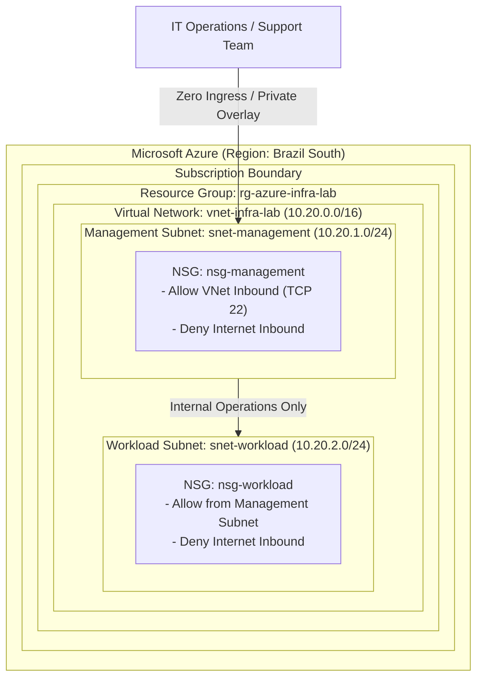

# Architecture & Cloud Networking Design

## Overview

This document describes the architectural topology, networking boundaries, and governance controls implemented in the **Azure Infrastructure Fundamentals Lab**.

The design mirrors corporate enterprise tiering practices within a cloud environment: separating management administrative endpoints from internal application workloads while enforcing strict default-deny ingress policies.

---

## Architectural Topology Diagram

---

## Core Infrastructure Components

### 1. Resource Group (`rg-azure-infra-lab`)
Acts as the logical lifecycle container. All associated resources share a single lifecycle, enabling clean provisioning, unified access control via Azure RBAC, aggregated cost tracking, and single-step decommissioning.

### 2. Virtual Network (`vnet-infra-lab`)
Provides private, isolated IPv4 space within Azure. Configured with a `/16` supernet (`10.20.0.0/16`), providing 65,536 private IP addresses to allow substantial future expansion without CIDR re-architecting.

### 3. Subnet Segmentation
- **Management Subnet (`snet-management`, `10.20.1.0/24`)**:
  Designated for jump hosts, administration utilities, automation agents, and monitoring tools.
- **Workload Subnet (`snet-workload`, `10.20.2.0/24`)**:
  Designated for backend databases, internal services, and application logic. Accessible strictly from the management subnet or internal peered routes.

*Note on Azure Reserved IPs*: In every Azure subnet, Microsoft reserves the first 4 addresses and the last address (5 IPs total):
- `.0`: Network address
- `.1`: Default Gateway
- `.2` & `.3`: Azure DNS mapping
- `.255`: Broadcast address

### 4. Network Security Groups (NSGs)
Stateful packet-filtering firewalls applied at the subnet level:
- **`nsg-management`**: Drops all public internet ingress. Allows intra-VNet management protocol traffic.
- **`nsg-workload`**: Isolates application layers from direct external exposure. Only permits traffic sourced from the management CIDR block (`10.20.1.0/24`).

### 5. Azure Region (`brazilsouth`)
Hosted in the São Paulo datacenter region (`brazilsouth`), ensuring low network latency (RTT < 15ms within São Paulo metropolitan area) and data residency compliance.

### 6. Infrastructure as Code (IaC) via Azure Bicep
Bicep provides a transparent, declarative abstraction over Azure Resource Manager (ARM) JSON. It ensures:
- Idempotency: Multiple runs produce identical infrastructure state.
- Modularity: Decouples network definitions (`network.bicep`) from orchestration (`main.bicep`).
- Static Analysis: Native linter (`az bicep build`) catches syntax, scoping, and security defects pre-deployment.

### 7. Governance & Resource Tagging
All resources inherit a unified taxonomy:
- `project`: `azure-infra-fundamentals`
- `environment`: `lab`
- `managedBy`: `bicep`
- `purpose`: `learning`
